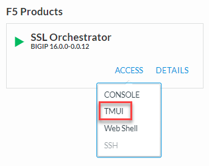
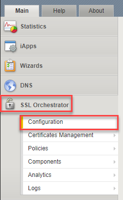
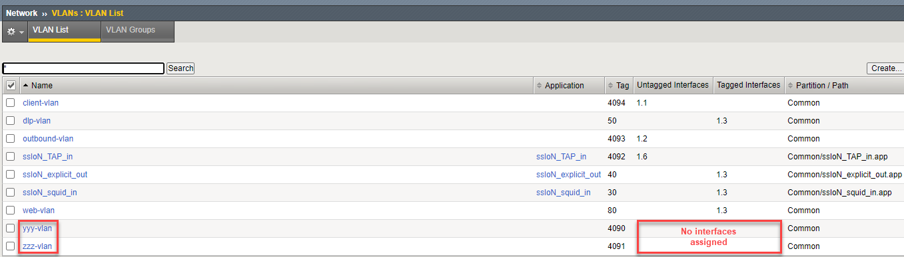

.. role:: red
.. role:: bred

Create WAFaaS Security Device
================================================================================

This next section of this lab will cover how to create a WAFaaS device. We will also attach a preconfigured WAF policy that will provide protection against attacks such as SQL-Injection and other OWASP Top 10 type vulnerabilities. 

Create the ICAP service
********************************************************************************

1. Login to the BIGIP via TMUI |credentials|

|udf-sslo-tmui|

2. Click on **SSL Orchestrator** on the left-hand menu and select **Configuration**.

|menu-sslo-config|

A topology must be bound to a unique VLAN. Since the layer topologies won't be listening on actual client-facing VLANs, you will need to create a separate empty VLAN for each topology you intend to create. An empty VLAN has no interfaces assigned.

- Navigate to **Network > VLANs** and click on the **Create** button to add a new VLAN.

- Name this VLAN:  ``zzz-vlan`` and then click on **Finished**. Do not select any interfaces.

   .. image:: ../images/create-vlan.png
      :alt: Empty VLAN

- Since you are not attaching any interfaces to this VLAN, you will receive a confirmation pop-up.

   .. image:: ../images/vlan-confirm-empty.png
      :alt: Empty VLAN Confirmation

-  Click on **OK** to continue and return to the VLAN List.

- Click on the **Create** button again to add a second empty VLAN.

- Name this VLAN:  ``yyy-vlan`` and then click on **Finished**.

- Since you are not attaching any interfaces to this VLAN, you will receive a confirmation pop-up. Click on **OK** to continue and return to the VLAN List.

.. |credentials| raw:: html
      <a href="../labinfo.html#credentials" target="_blank"> User Credentials </a>   
