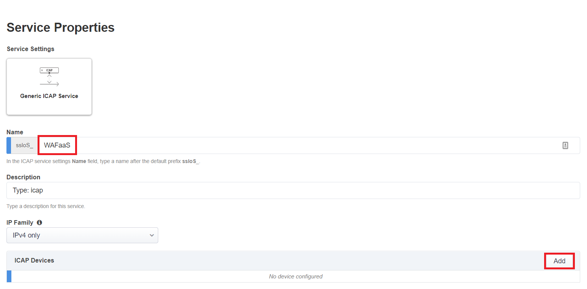

.. role:: red
.. role:: bred

Create WAFaaS Security Device
================================================================================

This next section of this lab will cover how to create a WAFaaS device. We will also attach a preconfigured WAF policy that will provide protection against attacks such as SQL-Injection and other OWASP Top 10 type vulnerabilities. 

Create the ICAP service
********************************************************************************

1. Login to the BIGIP via TMUI |credentials|

|udf-sslo-tmui|

2. Click on **SSL Orchestrator** on the left-hand menu and select **Configuration**.

|menu-sslo-config|

3. Click on **Services** on the middle menu bar and then click **Add** to add new service.

|sslo-gc-services|

4. Click **ICAP**, select **Generic ICAP Service**, and then click **Add** from below.

|service-icap-1|

5. Type **WAFaaS** as the **Name**. Click **Add** next to **ICAP Devices**.

|service-icap-2|

6. Type ``192.19.97.200`` for the **IP Address** and then click **Done**.

|service-icap-ip|

7. Scroll to the bottom of the page and click **Save & Next** to finish creating the **ICAP Service**.

|service-icap-save|

8. Next we need to create a new service chain where our new WAFaaS ICAP service will be placed. Click **Add** under the **Services Chain List** to add a new service chain.

|service-chain-01|

.. |menu-sslo-config| image:: ../images/menu-sslo-config.png
   :alt: SSL Orchestrator Configuration Menu

.. |sslo-gc-services| image:: ../images/sslo-gc-services.png
   :alt: SSLO GC Services

.. |service-icap-1| image:: ../images/service-icap-1.png
   :alt: ICAP service

.. |credentials| raw:: html
      <a href="../labinfo.html#credentials" target="_blank"> User Credentials </a>   
