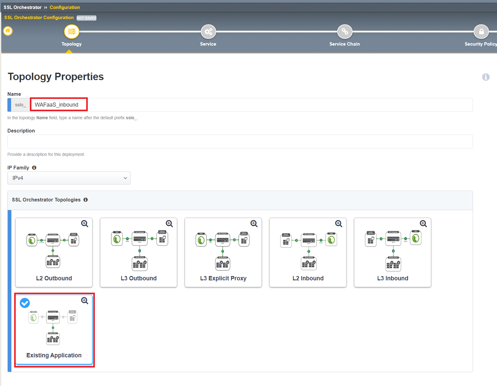

.. role:: red
.. role:: bred

Create Existing Application L3 Inbound Topology
================================================================================

Now that we have our WAFaaS device and security chain created, we will now create an **Existing Application** topology that will be used to protect our vulnerable **Juiceshop** application.

1. Click on **SSL Orchestrator** and select **Configuration**

|SSL-Orchestrator-Configuration|

2. Click **Add** under the **Topologies** menu item.

|add-topologies|

3. Click **Next** through the Topology Information page.

4. Next to **Name**,  ``WAFaaS_inbound``. Select **Existing Application** under **SSL Orchestrator Topologies**. CLick **Save & Next** once complete.

|Topology-Properties|

5. Test

.. |add-topologies| image:: ../images/add-topologies.png
   :alt: Under topologies, Click Add

.. |SSL-Orchestrator-Configuration| image:: ../images/SSL-Orchestrator-Configuration.png
   :alt: Go to SSL Orchestrator -> Configuration

.. |egress-settings-deploy-ribbon| image:: ../images/egress-settings-deploy-ribbon.png
   :alt: Deploy Ribbon on Egress Settings