.. role:: red
.. role:: bred

Validate WAFaaS
================================================================================

Let's take a look to see if our WAFaaS is providing the protection that we are looking for.

1. RDP back into the **Ubuntu Client 18.04**. (Components > Ubuntu18.04 Client > ACCESS > XRDP)

|udf-ubuntu-client-rdp|

2. When prompted, save the RDP file to your local machine and then open it to connect.

3. At the Ubuntu Login prompt, click on the OK button to continue.

|udf-ubuntu-client-rdp2|

.. tip:: If the RDP session times out, refer to the `User Credentials <https://github.com/Doctorwooo/f5-agility-labs-sslviz/blob/master/docs/class2/labinfo.rst>`_ for the **student** user password.

4. Open the Firefox browser

5. Click on the Juiceshop bookmark on the browser bar

|juiceshop-bookmark|

6. Accept the security risk by clicking **Advanced** and **Accept the Risk and Continue**. This is due to the BIGIP using a self-signed certificate.

   .. image:: ../images/certificate-risk.png

Now we will try the same simple SQL injection attack that we used at the beginning of this lab.

  .. image:: ../images/juiceshop-rdp.png

7. Copy and Paste the following path in your browser's location bar after https://10.1.20.200/

  .. code-block:: none
   
    /rest/products/search?q=qwert%27%29%29%20UNION%20SELECT%20id%2C%20email%2C%20password%2C%20%274%27%2C%20%275%27%2C%20%276%27%2C%20%277%27%2C%20%278%27%2C%20%279%27%20FROM%20Users--

8. The browser's location bar should look like this:

  .. code-block:: none

    https://10.1.20.200/rest/products/search?q=qwert%27%29%29%20UNION%20SELECT%20id%2C%20email%2C%20password%2C%20%274%27%2C%20%275%27%2C%20%276%27%2C%20%277%27%2C%20%278%27%2C%20%279%27%20FROM%20Users--

9. The SQL-Injection attack has been successfully blocked by the WAF policy attached to your inbound topology.

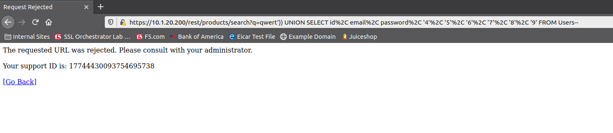

Let's look at the WAF logs to see where F5 Advanced WAF blocked our SQL-Injection attack.

10. Accessing the BIG-IP, on the left side bar menu goto **Security>>Event Logs>>Application>>Requests**. Click on one of the log entries that has **/rest/products/search**.

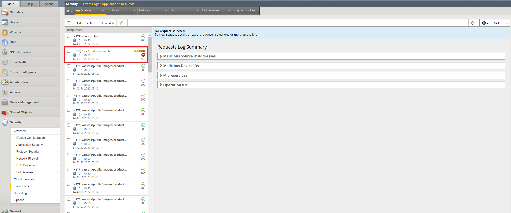

11. Lots of good information on this page regarding the attack. We can see that it was a SQL-Injection attack that was blocked, where it came from and even see the decoded attack.

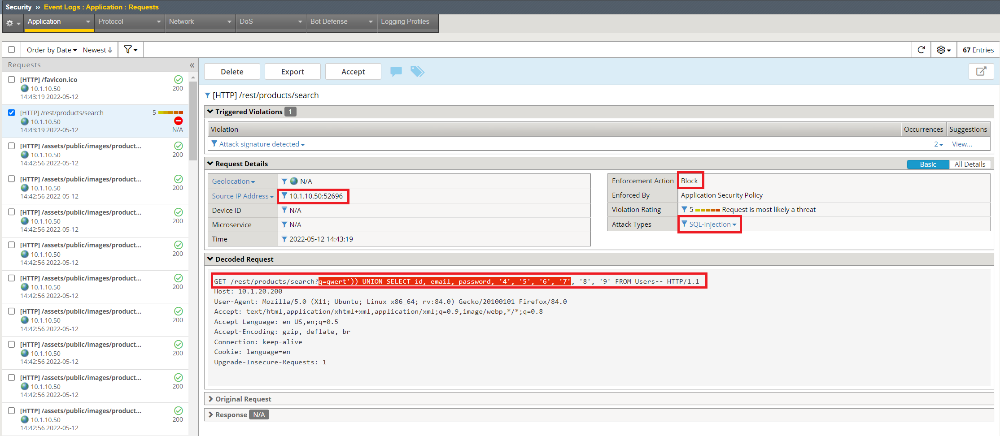

LAB COMPLETE!!

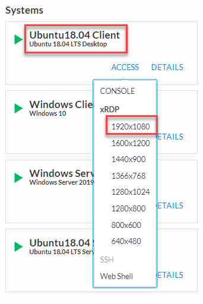

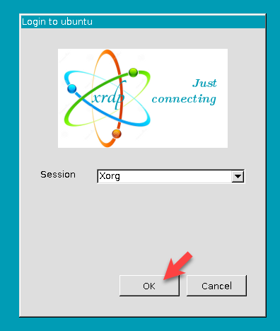

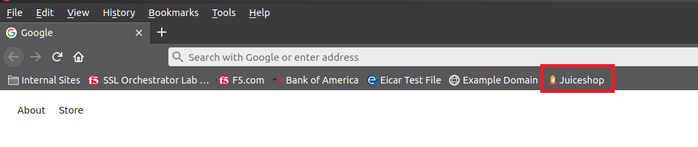

You will need to add an L3 Explicit topology for the outbound application server traffic. This topology will decrypt TLS and send traffic to a service chain consisting of:

   #. New ICAP-based antivirus service
   #. Existing Cisco Firepower TAP service

L3 Explicit Topology
------------------------

-  Navigate to **SSL Orchestrator > Configuration** and **Add** a new topology.

-  Scroll to the bottom of the Configuration introduction page and click on the **Next** button.

-  Enter ``appsvr_explicit`` as the topology name. Ensure that the name is entered exactly as shown because it will be referenced in a later step.

-  Select the **L3 Explicit Proxy** topology type.

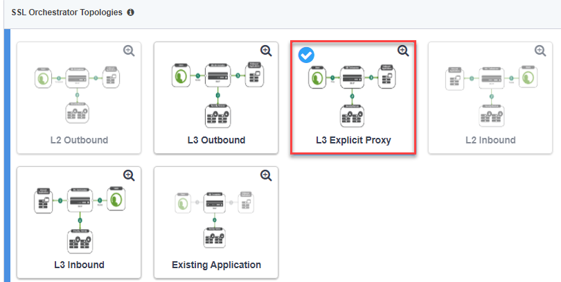

-  Click the **Save & Next** button to continue.

SSL Configurations
-------------------

-  In the **CA Certificate Key Chain** section, click on the pencil icon to edit.

-  Select **subrsa.f5labs.com** for both **Certificate** and **Key**.

.. warning:: 
   Ensure that you are editing the **CA Certificate Key Chain** shown above, not the *Certificate Key Chain*.  They look very similar.

-  Click **Done**. The **SSL** settings have now been configured.

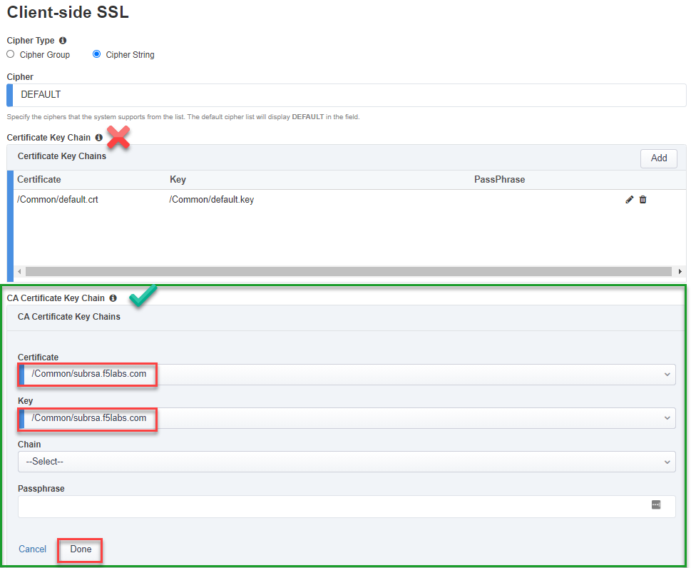

|

-  Click the **Save & Next** button to continue.

ICAP service
---------------

-  On the **Services List** screen, click the **Add** button.

-  Type  ``icap`` in the **Search** box

-  Select **Generic ICAP Service** and click the **Add** button

.. image:: ../images/service-icap-1.png
   :alt: ICAP Service
   :align: left

-  On the **Service Properties** screen, enter the following values:

   -  Enter ``CLAM_AV`` in the **Name** field.

   -  Enter ``ClamAV`` in the **Description** field.

   -  In the **ICAP Devices** section, click on the **Add** button.

   -  Enter ``198.19.97.50`` in the **IP Address** field.

   -  Leave the **Port** set to ``1344`` (default for ICAP).

   -  Click on **Done** to add the ICAP device.

   .. image:: ../images/service-icap-2.png
      :alt: ICAP Service
      :align: left

   -  Enter ``/avscan`` in the **Request Modification URI Path** field.
   
   -  Enter ``/avscan`` in the **Response Modification URI Path** field.

   -  Enter ``1048576`` in the **Preview Max Length(bytes)** field.

   .. image:: ../images/service-icap-3.png
      :alt: ICAP Service
      :align: left

   -  Click **Save** to return to the **Services List**.

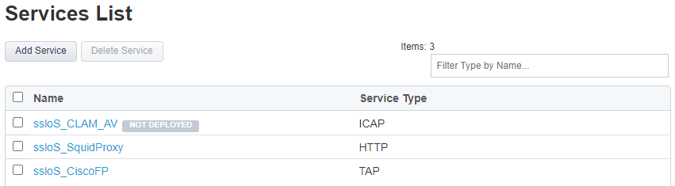

-  Click the **Save & Next** button to continue.

Service Chain
----------------

You now need to create a new Service Chain containing the CLAM_AV and Cisco Firepower TAP services.

-  On the **Services Chain List** screen, click the **Add** button.

-  On the **Services Chain Properties** screen, enter the following values:

   -  Enter ``CAV_CiscoFP`` in the **Name** field.

   -  Enter ``ClamAV and Cisco Firepower TAP`` in the **Description** field.

   -  **Services -** select the **CLAM_AV** and **CiscoFP_TAP** services under **Services Available** and move them to **Selected Service Chain Order**

   .. image:: ../images/internal-layered-new-sc.png
      :alt: New service chain for Clam AV and Cisco Firepower TAP
      :align: left

-  Click the **Save** button to return to the **Service Chain List**.

-  Click the **Save & Next** button to continue.

Security Policy
-----------------

You now need to create a new Security Policy for the **appsvr_explicit** topology.

-  On the **Security Policy** screen, modify the **All Traffic** rule by clicking on the pencil icon.

-  Select the **ssloSC\_SC\_CAV\_CiscoFP** Service Chain.

-  Click the **OK** button.

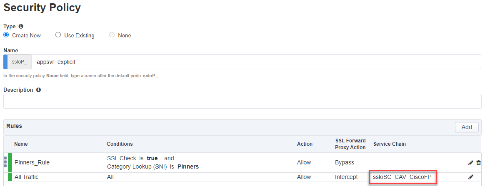

-  Click the **Save & Next** button to continue.

Interception Rule / Proxy Server Settings
-------------------------------------------

-  Skip down to the **Proxy Server Settings** section.

-  Enter ``10.1.10.175`` in the  **IPV4 Address** field.

   .. note::
      An IP address is required for an explicit proxy configuration, but it won't actually be referenced in this design since it is associated with an empty VLAN.

-  Leave the **Port** set to ``3128`` (default value).

-  In the **VLANs** section, select the **/Common/zzz-vlan** VLAN and and move it to Selected column.

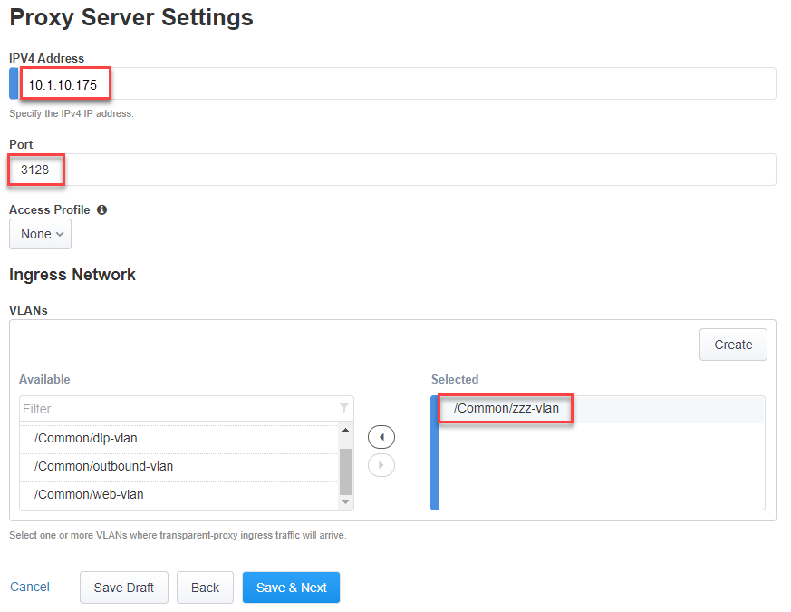

-  Click the **Save & Next** button.

Egress Settings
-----------------

-  On the Egress Settings screen, select **Auto Map** in the **Manage SNAT Settings** field.

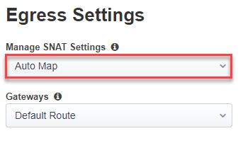

-  Click the **Save & Next** button.

Log Settings
--------------

-  On the Log Settings screen, leave all the default values.

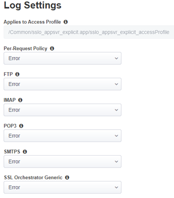

-  Click the **Save & Next** button to continue.

Summary
----------

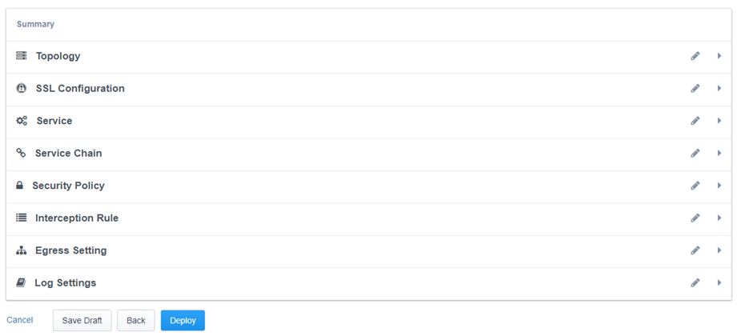

-  Click the **Deploy** button.

-  When successfully deployed, click the **OK** button to return to the SSL Orchestrator Configuration screen.

You should now have two L3 Explicit topologies. The third topology is an L3 Outbound (transparent) topology that is not applicable to this lab exercise.

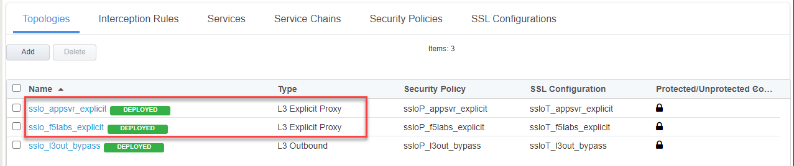

